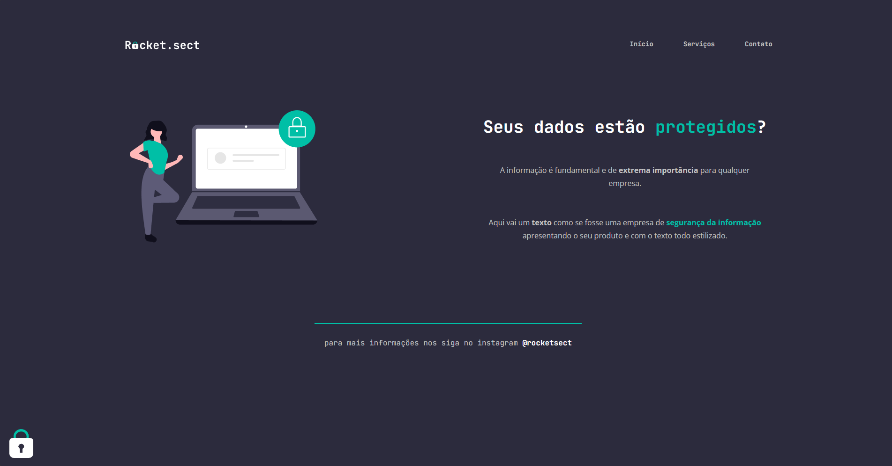

# Desafio avançado - Recriando layout.

### Desafio extra, Modulo Explorer RocketSeat, empresa de segurança da informação "Rocket.sect".

Neste desafio, a aplicação foi desenvolvida a partir de um layout já existente. Com base nos conhecimentos adquiridos em aula, o objetivo foi utilizar esses conhecimentos de maneiras diferentes daquelas apresentadas, a fim de recriar o layout proposto.

## Tecnologias utilizadas :
- HTML
- CSS

## Representação do projeto:

